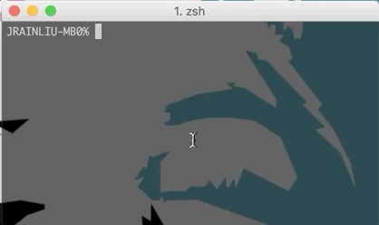
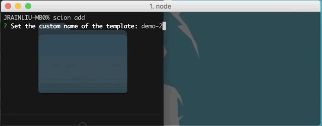
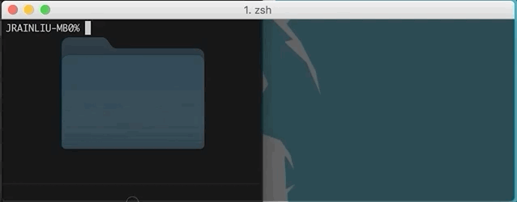
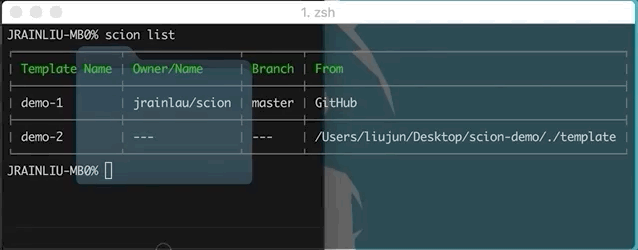

# Scion


**Scion** is a scaffold for initiating new projects from a given template.

## Template
A *template* is a sample folder with many files. You could place a template to GitHub, GitLab, Bitbucket or any other code repository, even in your local mechine!

## Usage
Install **Scion** globaly.
```bash
npm install scion-cli -g
```

Check the `--help` command.
```bash
scion --help
```

```bash
Usage: scion <command>

Options:
  -V, --version  output the version number
  -h, --help     output usage information

Commands:
  add|a          Add a new template
  list|l         List all templates
  delete|d       Delete a template
  init|i         Generate a new project
```

Just follow the FAQs and you will know how to use it.

- Add a template
  
  

  

- List all templates
  
  

- Delete a template
  
  

- Init a new project
  
  

## License
MIT

